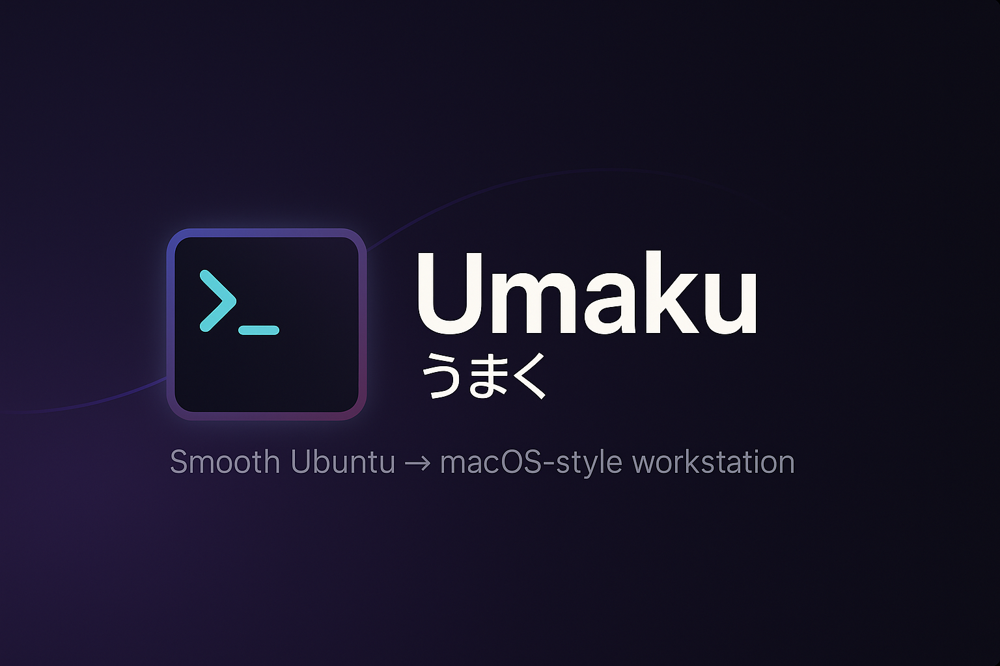

<h3 align="center">
 
</h3>

### *A smooth, skillful, and elegant Ubuntu setup framework.*

**Umaku** (うまく — *"smoothly / skillfully / efficiently"*) is a production-ready, automated setup framework that transforms a fresh Ubuntu installation into a beautifully polished, macOS-inspired developer workstation. Built with modularity and desktop-friendliness in mind, Umaku delivers enterprise-level automation with zero-maintenance security.

---

## ✨ **What Makes Umaku Special**

🎯 **Desktop-First Design** — Unlike server-focused scripts, Umaku is built specifically for desktop/laptop workflows  
🛡️ **Automated Security** — Set-and-forget security with anacron scheduling for machines that aren't always on  
🎨 **macOS Polish** — Brings macOS refinement to Ubuntu's power with Catppuccin theming and refined UI  
🧩 **True Modularity** — Terminal-only or full desktop setup, your choice  
⚡ **Modern Stack** — Leverages the latest tools (mise, zed, ghostty, starship) with sensible defaults  

---

## 🚀 **Quick Start**

**For Ubuntu 24.04+ systems:**

```bash
bash <(curl -s https://raw.githubusercontent.com/mrpbennett/umaku/refs/heads/main/boot.sh)
```

The interactive installer will guide you through:
- **System validation** (Ubuntu 24.04+, x86_64 architecture)
- **User identification** (Git configuration)
- **Component selection** (Terminal-only or full desktop setup)
- **Security hardening** (Automated malware/rootkit detection, integrity monitoring)

---

## 📦 **What Gets Installed**

### 🖥️ **Desktop Environment (GNOME Only)**
**Theme & Polish:**
- Catppuccin color scheme across all applications
- JetBrains Mono Nerd Font + iA Writer Mono
- Refined GNOME extensions (Tactile, Blur My Shell, Space Bar, etc.)
- macOS-inspired dock and app grid organization

**Applications:**
- **Terminal**: Ghostty (default), with transparency and theming
- **Browser**: Google Chrome with optimized flags
- **Editor**: Zed with Catppuccin theme and developer settings
- **Utilities**: Flameshot, LocalSend, GNOME Tweaks, ULauncher
- **Office**: LibreOffice suite
- **Flatpak**: Enabled with Flathub for additional apps

### 🔧 **Developer Environment**
**Shell & CLI Tools:**
- **Shell**: Zsh with Starship prompt
- **Version Management**: mise (Node.js, Python, Go, Java)
- **Container**: Docker with logging limits and rootless extras
- **Git**: GitHub CLI with user configuration
- **Modern CLI**: `fzf`, `ripgrep`, `bat`, `eza`, `zoxide`, `fd-find`
- **Monitoring**: btop, fastfetch
- **Productivity**: lazygit, lazydocker, k9s

**Editors & IDEs:**
- **Neovim**: Latest stable with LazyVim configuration
- **Zed**: Modern editor with Catppuccin theme
- Both configured with transparency and consistent theming

### 🛡️ **Security Suite (Zero-Maintenance)**
**Automatic Updates:**
- Unattended security upgrades
- Automatic virus definition updates

**Malware Protection:**
- **ClamAV**: Weekly full system scans (Saturdays 1 AM)
- **rkhunter**: Weekly rootkit detection (Sundays 1 AM)

**Integrity Monitoring:**
- **AIDE**: Weekly file integrity checks (Sundays 2 AM)

**Desktop-Friendly Scheduling:**
- Uses **anacron** instead of cron - catches up on missed scans when computer boots
- All security tasks run automatically with comprehensive logging
- No maintenance required, works perfectly for laptops/desktops

---

## 🏗️ **Architecture**

```
umaku/
├── 🚀 boot.sh              # Bootstrap installer
├── 📋 install.sh           # Main installation coordinator
├── 🛡️ security.sh          # Automated security setup
├── 
├── 📁 install/
│   ├── 🖥️ desktop/         # Desktop apps, themes, GNOME setup
│   ├── 💻 terminal/        # CLI tools, development environment
│   └── ✅ check-version.sh # System validation
│
├── 📁 bin/
│   ├── umaku              # Post-install management CLI
│   └── umaku-sub/         # Management subcommands
│
├── 📁 configs/            # Application configurations
├── 📁 themes/             # Catppuccin theme files
├── 📁 applications/       # Custom .desktop files
└── 📁 defaults/           # Default settings and preferences
```

### **Installation Flow:**
1. **Validation** → OS/architecture compatibility check
2. **Bootstrap** → Install git, clone repository
3. **Security** → Deploy automated security suite
4. **Terminal** → Install development environment  
5. **Desktop** → Install GUI apps and theming (GNOME only)
6. **Management** → Setup `umaku` CLI for ongoing management

---

## 🔧 **Post-Installation Management**

After installation, use the `umaku` command for ongoing management:

```bash
umaku                    # Interactive menu
umaku theme             # Switch themes
umaku font              # Install additional fonts
umaku update            # Update Umaku itself
umaku install           # Install additional components
umaku uninstall         # Remove Umaku
```

---

## 🎯 **Design Philosophy**

### **1. Desktop-First Approach**
Unlike server automation scripts, Umaku assumes:
- Machines that get turned off (anacron vs cron)
- Visual polish matters (theming, fonts, animations)
- Interactive workflows (GUI apps, extensions)

### **2. Zero-Maintenance Security**
Security should protect without requiring ongoing attention:
- Automatic updates and scans
- Desktop-friendly scheduling
- Comprehensive logging for audit trails

### **3. Opinionated Excellence**
Rather than endless options, Umaku provides:
- Curated, battle-tested tool selection
- Consistent theming across all applications
- Professional defaults that work immediately

### **4. Modular Yet Cohesive**
- Terminal environment works standalone
- Desktop components enhance but don't require terminal setup
- Each module is independently functional

---

## 🧪 **System Requirements**

**Required:**
- Ubuntu 24.04+ (fresh installation recommended)
- x86_64 architecture
- Internet connection
- Sudo privileges

**Recommended:**
- 4GB+ RAM
- 20GB+ available disk space
- GNOME desktop environment (for full experience)

**Tested On:**
- Ubuntu 24.04 LTS Desktop
- Ubuntu 24.10 Desktop
- Fresh installations and existing systems

---

## 🛡️ **Security Features**

### **Automated Protection:**
- **Real-time**: Automatic security updates, virus definition updates
- **Weekly**: Full system virus scans, rootkit detection, file integrity checks
- **Desktop-aware**: Uses anacron to handle laptops that aren't always on

### **Privacy & Safety:**
- No telemetry or data collection
- All configurations stored locally
- Open source with reviewable security implementations

### **Logging & Monitoring:**
- Centralized logs: `/var/log/{clamav,rkhunter,aide}/`
- Timestamped security events
- Easy audit trail for compliance

---

## 🗺️ **Roadmap**

### **v0.2.0 - Security & Stability**
- [ ] GPG signature verification for remote scripts
- [ ] Docker rootless option
- [ ] Enhanced error recovery
- [ ] Backup/restore functionality

### **v0.3.0 - Platform Expansion**
- [ ] KDE Plasma support
- [ ] Fedora/openSUSE compatibility
- [ ] ARM64 architecture support

### **v0.4.0 - Advanced Features**
- [ ] Tiling window manager option (i3/sway)
- [ ] Plugin system for community modules
- [ ] Cross-platform dotfiles sync
- [ ] GUI management application

---

## 🤝 **Contributing**

We welcome contributions! Please:

1. **Open an issue** for bugs or feature requests
2. **Start a discussion** before major changes
3. **Follow existing patterns** in the codebase
4. **Test on fresh Ubuntu installations**

**Areas where help is needed:**
- Testing on different Ubuntu variants
- Additional security hardening
- KDE/other desktop environment support
- Documentation improvements

---

## 📚 **Documentation**

- **Security Guide**: See `security.sh` for detailed security implementation
- **Customization**: Check `configs/` directory for configuration examples  
- **Troubleshooting**: Use `umaku manual` for common issues
- **Architecture**: Review `install/` directory structure

---

## 📄 **License**

MIT License — See [LICENSE](LICENSE) for details.

**In Short**: Use, modify, and share freely. Commercial use allowed.

---

## 🙏 **Acknowledgments**

Umaku stands on the shoulders of giants:
- **Catppuccin** community for beautiful, consistent theming
- **LazyVim** for excellent Neovim configuration
- **Ubuntu** team for the solid foundation
- All the amazing open-source tools integrated in this project

---

**Ready to transform your Ubuntu experience? [Get started now!](#-quick-start)**