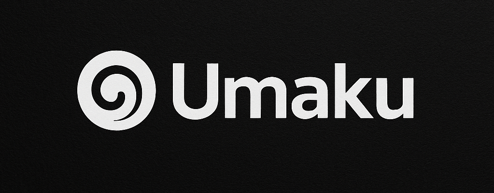

<h3 align="center">
 
</h3>

### *A smooth, skillful, and elegant Ubuntu-based setup experience.*

**Umaku** (うまく — *“smoothly / skillfully / efficiently”*) is a curated, automated setup framework that transforms a fresh Ubuntu install into a beautifully polished, Mac-inspired workstation.
It brings together the best of **Ubuntu’s power** and **macOS refinement**, packaged into a fast, modern bootstrap experience.

---

## ⭐ Features

* 🎨 **Unified macOS-inspired UI theme** (icons, dock, fonts, animations)
* ⚙️ **Opinionated developer environment**

  * Zsh + starship
  * Homebrew support
  * Common CLI tools
* 📦 **Automatic app installation**

  * Browsers, dev tools, productivity apps, terminals, etc.
* 🧩 **Modular architecture** — enable/disable features easily
* 🚀 **Fast bootstrap** — get a full workstation setup in minutes
* 🛠️ **Flexible customization** — adjust scripts, packages, themes to your needs

---

## 📥 Installation

On a fresh Ubuntu 22.04+ system:

```bash
bash <(curl -s https://raw.githubusercontent.com/mrpbennett/umaku/refs/heads/main/install.sh)
```

The installer guides you through optional modules and configurations.

---

## 🧱 Project Structure

```
📁
├── 📁 bin
│   ├── umaku
│   └── umaku-sub
├── 📁 configs
├── 📁 defaults
├── 📁 install
│   ├── check-version.sh
│   ├── 📁 desktop
│   │   ├── app-*.sh
│   ├── desktop.sh
│   ├── indentifaction.sh
│   ├── 📁 terminal 
│   │   ├── app-*.sh
│   │   └── 📁 required
│   │       └── app-gum.sh
│   └── terminal.sh
├── install.sh
├── README.md 
```

---

## 🎯 Philosophy

Umaku is built on three core principles:

1. **Smooth Experience** — everything should “just work.”
2. **Skillful Defaults** — sane, thoughtful, developer-friendly choices.
3. **Elegance Through Simplicity** — no bloat, no complexity, no clutter.

---

## 🧪 Roadmap

* ☐ KDE & GNOME theme packs
* ☐ Optional tiling window manager setup
* ☐ Linux/Mac cross-portable dotfiles
* ☐ Post-install GUI customization tool
* ☐ Plugin system for community modules

---

## 🤝 Contributing

PRs and issues are welcome!
Please open a discussion before large changes.

---

## 📄 License

MIT License — use, modify, and share freely.
# umaku
